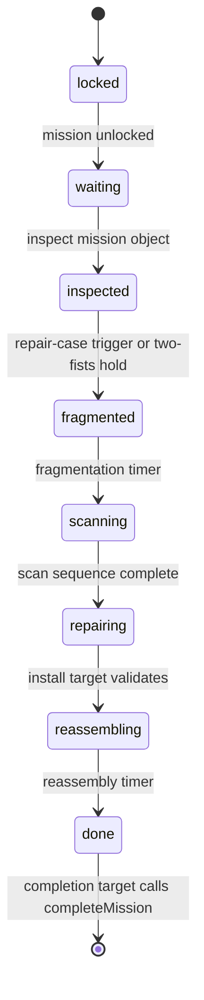

# Repair Game Technical Notes

This document explains the implementation of the reusable repair-game flow.

## Purpose

The repair game is the current core gameplay loop. It gives three missions the same interaction structure while allowing mission-specific assets, broken parts, replacement choices, prompts, and timing to live in data.

Implemented missions:

| Mission | Object        | Role                                          |
| ------- | ------------- | --------------------------------------------- |
| `ebike` | E-bike        | Repair a damaged cooling core                 |
| `pylon` | Power pylon   | Restore relay/panel-like broken parts         |
| `farm`  | Vertical farm | Stabilize irrigation/sensor-like broken parts |

## Main Files

| File                                           | Responsibility                                    |
| ---------------------------------------------- | ------------------------------------------------- |
| `src/components/three/gameplay/RepairGame.tsx` | Orchestrates the repair step machine              |
| `src/data/gameplay/repairMissions.ts`          | Mission-specific data                             |
| `src/types/gameplay/repairMission.ts`          | Mission ids, step ids, guards                     |
| `src/managers/stores/useGameStore.ts`          | Global progression and mission transitions        |
| `src/world/GameStageContent.tsx`               | Production placement of the three repair missions |
| `src/world/debug/TestMap.tsx`                  | Debug repair playground placement                 |

## State Machine

Repair mission steps are defined in:

```txt
src/types/gameplay/repairMission.ts
```

```txt
locked -> waiting -> inspected -> fragmented -> scanning -> repairing -> reassembling -> done
```

The practical flow is:



There is no dedicated finite-state-machine library. The state machine is intentionally lightweight and distributed across:

- `MissionStep` union types
- Zustand transition helpers
- conditional rendering in `RepairGame`
- callbacks passed to step components

For the current prototype, this is readable and low overhead. If mission rules become much more branched, a centralized mission orchestrator or FSM library would become more useful.

## Integration With Zustand

The durable state lives in:

```txt
src/managers/stores/useGameStore.ts
```

`RepairGame` reads:

- `mainState`
- current step for its mission

`RepairGame` writes:

- `setMissionStep(mission, nextStep)`
- `completeMission(mission)`

The important architectural choice is that reusable repair components do not call `setEbikeState`, `setPylonState`, or `setFarmState` directly. They use generic mission actions so the same component can run for all three missions.

## Data-Driven Mission Config

Mission variation lives in:

```txt
src/data/gameplay/repairMissions.ts
```

Each mission config defines:

- `id`
- `label`
- `description`
- `modelPath`
- optional `modelScale`
- `stageUiPath`
- `interactUiPath`
- `brokenUiPath`
- repair case transform
- optional scan/reassembly timings
- `requiredReplacementPartId`
- `brokenParts`
- `replacementParts`

The main benefit is that `RepairGame` stays generic. A mission can change broken nodes, replacement choices, or prompt videos without changing the orchestration component.

The tradeoff is that the config can grow complex. If one future mission needs very different rules, create a mission-specific component instead of forcing every exception into the shared config.

## Orchestration Component

`RepairGame.tsx` is a step router.

It:

1. receives a `mission` id and transform props
2. gets `config = REPAIR_MISSIONS[mission]`
3. subscribes to the active `mainState`
4. subscribes to the current mission step
5. preloads mission assets
6. mounts the component for the active step
7. stores local runtime state needed between steps

Local runtime state:

- `casePlaceholders`: placeholder transforms emitted by the repair case GLTF
- `scannedBrokenParts`: output of the scan sequence used by the repair step

Those values are local because they are transient scene/runtime details. They do not need to persist globally in Zustand.

## Step Components

### Waiting

File:

```txt
src/components/three/gameplay/RepairInspectionObject.tsx
```

The mission object is rendered with a 3D prompt video and wrapped in an interaction trigger. Pressing `E` while focused moves the mission to `inspected`.

### Inspected

Files:

```txt
src/components/three/gameplay/RepairMissionCase.tsx
src/components/three/gameplay/RepairCaseModel.tsx
src/hooks/gameplay/useRepairFragmentationInput.ts
```

The repair case appears near the mission object. The player can:

- aim at the case and press `E`
- hold both fists closed for one second when hand tracking is active

Both paths move to `fragmented`.

Important current detail: `useRepairMovementLocked()` currently returns `false`, so the movement-lock rule and indicator are present but disabled in the current branch.

### Fragmented

File:

```txt
src/components/three/models/ExplodableModel.tsx
```

The mission object is shown split apart. A timer then moves the mission to `scanning`.

The default delay comes from:

```txt
REPAIR_FRAGMENTATION_SEQUENCE_SECONDS
```

### Scanning

File:

```txt
src/components/three/gameplay/RepairScanSequence.tsx
```

The scan sequence:

- keeps the exploded model visible
- receives model parts from `ExplodableModel`
- advances an active part index over time
- renders `RepairScanVisual` on the active part
- reveals broken-part highlights when configured broken parts have been reached
- returns `RepairScannedBrokenPart[]` when done

Broken-part lookup first tries `brokenParts[].nodeName`. If no configured node matches, it falls back to the first available exploded parts. This fallback is useful while GLTF node names are still unstable, but precise `nodeName` config is safer for production.

### Repairing

File:

```txt
src/components/three/gameplay/RepairRepairingStep.tsx
```

This is the densest gameplay step.

It renders:

- install target
- placeholder markers
- grabbable replacement parts
- grabbable broken parts to store
- placement feedback
- ready-to-install prompt

Important local state:

- `placedPartIds`: replacement parts that snapped near a placeholder
- `depositedBrokenPartIds`: broken parts stored in the case
- `showBlockedInstallFeedback`: temporary visual feedback when install is attempted too early

Validation:

```txt
correct replacement part placed
AND every scanned broken part deposited
```

Only then does the install target call `onRepair()` and move to `reassembling`.

### Reassembling

File:

```txt
src/components/three/gameplay/RepairReassemblyStep.tsx
```

The exploded model animates back into assembled form and completion particles play. A timer then moves the mission to `done`.

Mission configs can override the default reassembly duration.

### Done

File:

```txt
src/components/three/gameplay/RepairCompletionStep.tsx
```

The repaired object remains visible. The player validates the completion target, then:

1. the repair case closes
2. the case plays its exit animation
3. `completeMission(mission)` advances the global game progression

## Repair Case Details

The case model implementation lives in:

```txt
src/components/three/gameplay/RepairCaseModel.tsx
```

It handles:

- GLTF loading through `useLoggedGLTF`
- clone creation through `useClonedObject`
- pop-in animation
- lid open/close animation
- open/close SFX through `AudioManager`
- proximity-based floating
- small rotation wobble
- exit animation
- placeholder discovery

Placeholder discovery is data-friendly:

```txt
placeholder_*
```

Any GLTF node whose name starts with that prefix is exported to the repair step as a placement target. This lets artists move placeholder transforms in the model file without hard-coding every placement point in TypeScript.

## Interaction Dependencies

The repair game depends on the shared interaction layer:

- `RepairInspectionObject` uses `InteractableObject`
- `RepairMissionCase` uses `TriggerObject`
- `RepairRepairingStep` uses `GrabbableObject` and `TriggerObject`
- completion uses `TriggerObject`

This keeps the repair game from owning raw keyboard or mouse listeners for every object. The player controller handles input, and interaction components decide what is focused.

## Hand Tracking Dependencies

Hand tracking participates in two places:

- `useRepairFragmentationInput` uses `useBothFistsHold`
- `GrabbableObject` can be `handControlled`

`HandTrackingProvider` enables tracking during the repair steps that are expected to use hands:

```txt
inspected
repairing
reassembling
done
```

This avoids keeping the webcam active for the whole game scene.

## Runtime Placement

Production placement lives in:

```txt
src/world/GameStageContent.tsx
```

Current positions:

```tsx
<RepairGame mission="ebike" position={[42.2399, 4.5484, 34.6468]} />
<RepairGame mission="pylon" position={[64, 0, -66]} />
<RepairGame mission="farm" position={[-24, 0, 42]} />
```

Only the repair game whose `mission` matches `useGameStore().mainState` renders active content.

## Debug Placement

Debug placement lives in:

```txt
src/world/debug/TestMap.tsx
```

The debug scene mounts repair playground zones for all missions. Use `?debug`, switch to the physics scene in lil-gui, then use the game-state debug panel to activate the mission you want to test.

## Why This Is A Good Review Focus

This feature shows several important frontend/game architecture skills:

- state-driven scene composition
- data-driven feature variation
- React state for step-local runtime values
- Zustand for durable game progression
- R3F component boundaries
- Rapier object interaction
- hand tracking integration
- audio feedback
- GLTF traversal
- graceful asset fallbacks

## Known Limitations

- Movement lock is currently disabled by an early `return false` in `useRepairMovementLocked`.
- The repair-game runtime setting in the options menu is stored but not consumed by `RepairGame`.
- Broken-part scan fallback can produce incorrect matches if GLTF node names are missing.
- Mission progression is still prototype-level and not owned by a central `GameManager`.
- The same repair flow covers all missions. Very different future missions may need dedicated components.
